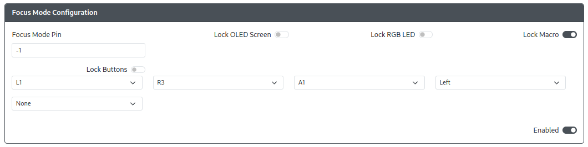

# Focus Mode Configuration

Purpose: This add-on is intended to allow you to disable a number of functions or inputs while Focus Mode is enabled, but otherwise still retain access to them.

## Web Configurator Options

- `Focus Mode Pin` - The GPIO pin used to enable Focus Mode
- `Lock OLED Screen` - When enabled, the OLED screen will not display anything during Focus Mode.
- `Lock RGB LED` - When enabled, the RGB LEDs that are controlled by the RP2040 device will not display anything during Focus Mode.
- `Lock Macro` - When enabled, macro triggers will not activate macro sequences during Focus Mode
- `Lock Buttons` - When enabled, listed inputs will not be sent during Focus Mode. As inputs are added, new dropdowns will appear for additional inputs.

## Hardware

### Requirements

The GPIO pin set in `Focus Mode Pin` needs to be brought and kept low to remain active. A toggle switch, slide toggle, or latching switch is necessary for proper use of this add-on.

### Installation

Installation will depend on whether a toggle switch, slide toggle, or latching switch is used. In general, on one side of the switch, connect the pin to the GPIO pin set in `Focus Mode Pin`. On the other side of the switch or the center if there are 3 contacts, connect it to any GND pin.

## Miscellaneous Notes

None.
