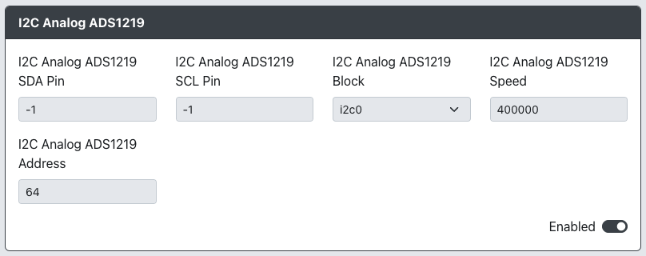

# I2C Analog ADS1219

Purpose: This add-on is intended to allow you to add Left and Right analog joystick functionality using the ADS1219 24-bit, analog-to-digital
converter (ADC).

## Web Configurator Options

- `I2C Analog ADS1219 SDA Pin` - The GPIO pin used for I2C Analog ADS1219 SDA.
- `I2C Analog ADS1219 SCL Pin` - The GPIO pin used for I2C Analog ADS1219 SCL.
- `I2C Analog ADS1219 Block` - The block of I2C to use (i2c0 or i2c1).
- `I2C Analog ADS1219 Speed` - Sets the speed of I2C communication. Common values are `100000` for standard, `400000` for fast and `800000` ludicrous speed.
- `I2C Analog ADS1219 Address` - Sets the address for the I2C Analog ADS1219 based on the pins used for SDA and SCL according to the table below.

| A0  | A1  | I2C Address |
| :-: | --- | :---------: |
| SDA | SCL |   1001110   |
| SCL | SDA |   1001011   |

## Hardware

### Requirements

This add-on requires an ADS1219 analog-to-digital converter (ADC) to function properly.

### Installation

Connect the pins on the ADS1219 according to the table below

| ADS1219 Pin | Function                     |
| :---------: | ---------------------------- |
|     A0      | SDA or SCL                   |
|     A1      | SDA or SCL                   |
|    AIN0     | Left analog joystick X-Axis  |
|    AIN1     | Left analog joystick Y-Axis  |
|    AIN2     | Right analog joystick X-Axis |
|    AIN3     | Right analog joystick Y-Axis |

 

:::info A0/A1 GPIO Assignment

These pins will need to be wired to the appropriate SDA/SCL pins on the RP2040 and set the correct `I2C Analog ADS1219 Block` in Web Configurator. See the table below.

|   SDA   |   SCL   | I2C Block |   SDA   |   SCL   | I2C Block |
| :-----: | :-----: | --------- | :-----: | :-----: | --------- |
| GPIO 0  | GPIO 1  | I2C0      | GPIO 2  | GPIO 3  | I2C1      |
| GPIO 4  | GPIO 5  | I2C0      | GPIO 6  | GPIO 7  | I2C1      |
| GPIO 8  | GPIO 9  | I2C0      | GPIO 10 | GPIO 11 | I2C1      |
| GPIO 12 | GPIO 13 | I2C0      | GPIO 14 | GPIO 15 | I2C1      |
| GPIO 16 | GPIO 17 | I2C0      | GPIO 18 | GPIO 19 | I2C1      |
| GPIO 20 | GPIO 21 | I2C0      | GPIO 22 | GPIO 23 | I2C1      |
| GPIO 24 | GPIO 25 | I2C0      | GPIO 26 | GPIO 27 | I2C1      |
| GPIO 28 | GPIO 29 | I2C0      |         |         |           |

:::

## Miscellaneous Notes

These installation instructions do not cover the additional circuitry required for the use of the ADS1219 ADC, only the wiring to the RP2040.

[ADS1219 Product Sheet](https://www.ti.com/lit/ds/symlink/ads1219.pdf)
