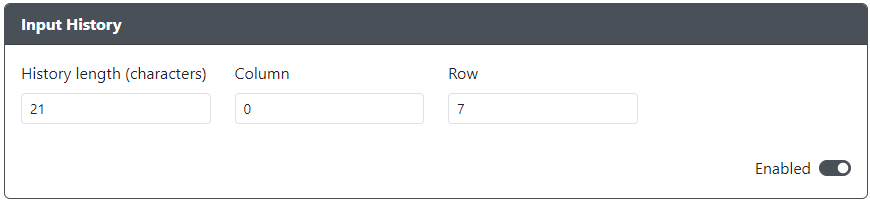

# Input History

Purpose: This add-on is intended to allow you to display input history

## Web Configurator Options

- `History Length` - Set the max character length of the history.
- `Column` - Specify the column at which the history begins on the display. ( 0 - left, 20 - right )
- `Row` - Specify the row on which the history appears on the display. ( 0 - top, 7 - bottom )

## Hardware

### Requirements

An already configured [monochrome display](../web-configurator/menu-pages/07-display-configuration.mdx).

### Installation

None.

## Miscellaneous Notes

Input - Symbol mapping:

| GP2040-CE | PS3 | Switch | XINPUT | KEYBOARD | PS4 | CONFIG |
|-----------|:---:|:------:|:------:|:--------:|:---:|:------:|
| Up        |  U  |    U   |    U   |     U    |  U  |    U   |
| Down      |  D  |    D   |    D   |     D    |  D  |    D   |
| Left      |  L  |    L   |    L   |     L    |  L  |    L   |
| Right     |  R  |    R   |    R   |     R    |  R  |    R   |
| B1        |  X  |    B   |    A   |    B1    |  X  |   B1   |
| B2        |  O  |    A   |    B   |    B2    |  O  |   B2   |
| B3        |  #  |    Y   |    X   |    B3    |  #  |   B3   |
| B4        |  ^  |    X   |    Y   |    B4    |  ^  |   B4   |
| L1        |  L1 |    L   |   LB   |    L1    |  L1 |   L1   |
| R1        |  R1 |    R   |   RB   |    R1    |  R1 |   R1   |
| L2        |  L2 |   ZL   |   LT   |    L2    |  L2 |   L2   |
| R2        |  R2 |   ZR   |   RT   |    R2    |  R2 |   R2   |
| S1        |  SL |    -   |   BK   |    S1    |  SH |   S1   |
| S2        |  ST |    +   |   ST   |    S2    |  OP |   S2   |
| L3        |  L3 |   LS   |   LS   |    L3    |  L3 |   L3   |
| R3        |  R3 |   RS   |   RS   |    R3    |  R3 |   R3   |
| A1        |  PS |    H   |    G   |    A1    |  PS |   A1   |
| A2        |  A2 |    C   |   A2   |    A2    |  T  |   A2   |
