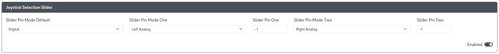

# Joystick Selection Slider

Purpose: This add-on is intended to allow users change the input mode of the primary gamepad directional inputs between D-Pad, Left analog joystick, and Right analog joystick using a three position toggle switch or slide toggle.

## Web Configurator Options

- `Slider Pin Mode Default` - The directional input mode that is active when neither `Slider Pin One` nor `Slider Pin Two` are held.
- `Slider Pin Mode One` - The directional input mode that is active when `Slider Pin One` is held.
- `Slider Pin One` - The GPIO pin used to activate the `Slider Pin Mode One` while held.
- `Slider Pin Mode Two` - The directional input mode that is active when `Slider Pin Two` is held.
- `Slider Pin Two` - The GPIO pin used to activate the `Slider Pin Mode Two` while held.

### Slider Pin Mode Options

- `Digital` - D-Pad directional inputs
- `Left Analog` - Cardinal directions on the Left Analog joystick at maximum magnitude.
- `Right Analog` - Cardinal directions on the Right Analog joystick at maximum magnitude.

## Hardware

### Requirements

The GPIO pins set in `Slider Pin Mode One` and `Slider Pin Mode Two` will each need to be brought and kept low to remain active to use that mode and when using the default mode, neither pin can be brought low. Therefore, a 3 position toggle switch or slide toggle is necessary for proper use of this add-on.

### Installation

Installation will depend on whether a toggle switch or slide toggle is used. In general, on one side of the switch, connect the pin to the GPIO pin set in `Slider Pin Mode One`. On the other side of the switch, connect the pin to the GPIO pin set in `Slider Pin Mode Two`. On the center pin, connect it to any GND pin.

## Miscellaneous Notes

None.
