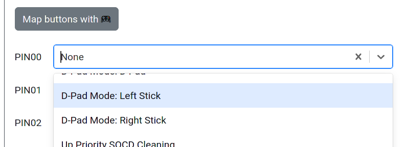

# Joystick Selection Slider

Purpose: This add-on is intended to allow users change the input mode of the primary gamepad directional inputs between D-Pad, Left analog joystick, and Right analog joystick using a two/three position toggle switch or slide toggle.

## Web Configurator Options

- `Slider Pin Mode Default` - The directional input mode that is active when no `D-Pad Mode` pins are held.

The pin(s) are configured [on the core Pin Mapping page](../web-configurator/menu-pages/pin-mapping) by choosing the desired input mode for the selected pin.

### Slider Pin Mode Options

- `Digital` - D-Pad directional inputs
- `Left Analog` - Cardinal directions on the Left Analog joystick at maximum magnitude.
- `Right Analog` - Cardinal directions on the Right Analog joystick at maximum magnitude.

## Hardware

### Requirements

The GPIO pins set on the Pin Mappings page will each need to be brought and kept low to remain active to use that mode, and when using the default mode, none of the pins can be brought low. Therefore, a 2 or 3 position toggle switch or slide toggle is necessary for proper use of this add-on.

### Installation

Installation will depend on whether a toggle switch or slide toggle is used. In general, on one side of the switch, connect the selection pin(s) to the GPIO pin(s) set. On the center pin, connect it to any GND pin.

## Miscellaneous Notes

Enabling this add-on will disable the use of the DPad [Hotkey Shortcuts](../hotkeys.mdx), resulting in the toggle switch or slide toggle set up with this add-on being the only method to set the DPad mode.
