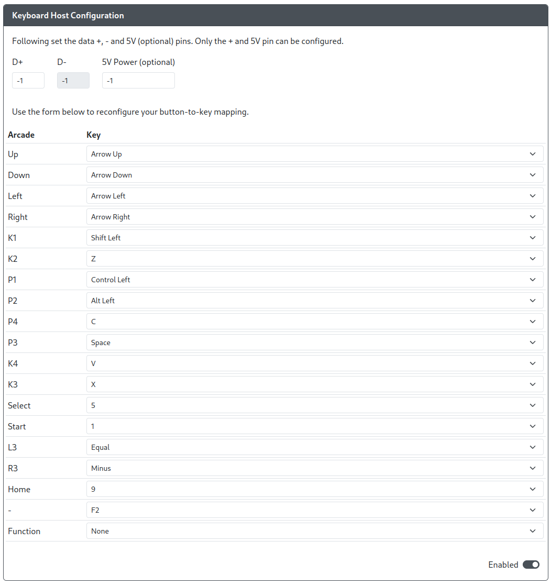

import InputLabelSelector, {
	Hotkey,
} from "@site/src/components/LabelSelector.tsx";
import PinOption from "../snippets/_pin-options-USB-Host.mdx";
import InstallUSBHostPort from "../snippets/_add-usb-host-port.mdx";

Select the button labels to be displayed in the usage guide:

<InputLabelSelector />
 

Purpose: This add-on is intended to allow you to use a keyboard with GP2040-CE to be used with GP2040-CE supported systems.

## Web Configurator Options

<PinOption />

### Default Keybindings

| GP2040                           | Key          |
| -------------------------------- | ------------ |
| <Hotkey buttons={["Up"]}/>       | Arrow Up     |
| <Hotkey buttons={["Down"]}/>     | Arrow Down   |
| <Hotkey buttons={["Left"]}/>     | Arrow Left   |
| <Hotkey buttons={["Right"]}/>    | Arrow Right  |
| <Hotkey buttons={["B1"]}/>       | Shift Left   |
| <Hotkey buttons={["B2"]}/>       | Z            |
| <Hotkey buttons={["B3"]}/>       | Control Left |
| <Hotkey buttons={["B4"]}/>       | Alt Left     |
| <Hotkey buttons={["L1"]}/>       | C            |
| <Hotkey buttons={["R1"]}/>       | Space        |
| <Hotkey buttons={["L2"]}/>       | V            |
| <Hotkey buttons={["R2"]}/>       | X            |
| <Hotkey buttons={["S1"]}/>       | 5            |
| <Hotkey buttons={["S2"]}/>       | 1            |
| <Hotkey buttons={["L3"]}/>       | Equal        |
| <Hotkey buttons={["R3"]}/>       | Minus        |
| <Hotkey buttons={["A1"]}/>       | 9            |
| <Hotkey buttons={["A2"]}/>       | F2           |
| <Hotkey buttons={["Function"]}/> | None         |

## Hardware

### Requirements

This add-on requires that you have something like the [USB Passthrough Board](https://github.com/OpenStickCommunity/Hardware/tree/main/USB%20Passthrough%20Board) or a board with a USB passthrough port on it already.

### Installation

<InstallUSBHostPort />

## Miscellaneous Notes

As long as the keyboard has a USB plug, any keyboard should work with this addon, including wireless USB keyboards.

Due to current implementation of Pico-PIO-USB and the add-on system, the following limitations are present.

- The keyboard is limited to only as many inputs as listed above. All other keys on the keyboard will not function and will send no inputs to the system reading inputs.
- The keyboard is limited to 6 key rollover, meaning that a maximum of 6 keyboard keys can be activated at a time. This is the case regardless if the keyboard being used normally has N key rollover (NKRO).
- The keyboard is unable to affect the Input Mode on boot. The Input Mode must either be set using `Web Configurator > Settings` or an additional switch on the GP2040-CE device using the add-on.
