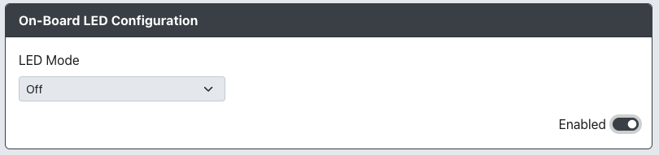

# On-board LED Configuration

Purpose: This add-on is intended to allow you to use the onboard LED of a board to act as either a Mode, Input Test or PS4/5 Authentication indicator.

## Web Configurator Options

- `Off` - LED is off
- `Mode Indicator`
  - LED is solid if device is powered with connected data
  - LED blinks rapidly if powered with no data
  - LED blinks slowly when in web-config mode
- `Input Test` - LED is off but turns on when any input is pressed (LED turns off when button is released).
- `PS4/5 Authentication` - LED is solid is when the authentication call has been triggered and is successful

## Hardware

### Requirements

This add-on requires that the RP2040 board being used already has a LED onboard.

### Installation

None.

## Miscellaneous Notes

None.
