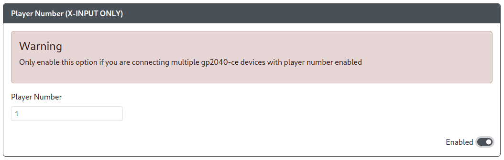

# Player Number

Purpose: This add-on is intended to allow you to set a static Player Number while using XInput mode.

## Web Configurator Options

- `Player Number` - Choose what player number this RP2040 based device will be representing.

## Hardware

### Requirements

This add-on is requires the controller input mode to be set to XInput mode.

### Installation

None

## Miscellaneous Notes

None
