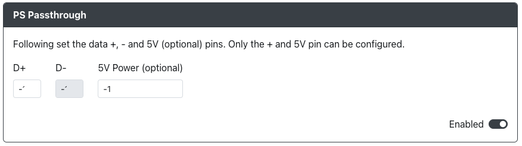

import PinOption from "../snippets/_pin-options-USB-Host.mdx";
import InstallUSBHostPort from "../snippets/_add-usb-host-port.mdx";

# PS Passthrough

Purpose: This add-on is intended to allow you to use a licensed 3rd party, "categorized" device to authenticate with a Playstation 4 or Playstation 5.

## Web Configurator Options

<PinOption />

:::caution

If you have PS Passthrough enabled, you must turn off the `PS4 Mode` add-on as the two will not work together.

Ensure that under the `Settings` section you have chosen the PS4 for the input mode in order to use the GP2040-CE device as a controller or as a fightstick.

:::

## Hardware

### Requirements

This add-on requires that you have something like the [USB Passthrough Board](https://github.com/OpenStickCommunity/Hardware/tree/main/USB%20Passthrough%20Board) or a board with a USB passthrough port on it already.

### Installation

<InstallUSBHostPort />

## Miscellaneous Notes

This add-on is not compatible with the [PS4 Mode](./ps-passthrough.mdx) add-on. In order to use one, the other must be disabled.
