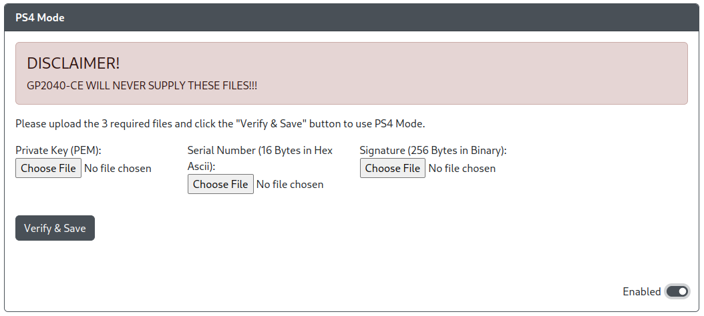

# PS4 Mode

Purpose: This add-on is intended to allow you to use your GP2040 device on a Playstation 4 and avoid the 8 minute timeout without the need for converters or passthrough authentication.

## Web Configurator Options

- `Private Key (PEM)` - Choose your PEM file.
- `Serial Number (16 Bytes in Hex Ascii)` - Choose your serial number file.
- `Signature (256 Bytes in Binary)` - Choose your signature file.

:::danger Warning

The GP2040-CE project will not provide any files or information related to acquiring these keys and files under any circumstances.

Do not ask via any of communication channels (e.g. social media, direct messages, Github Issues, GP2040-CE Discord) as this will result in a permanent blacklist/ban.

:::

## Hardware

### Requirements

None.

### Installation

None.

## Miscellaneous Notes

This add-on is not compatible with the [PS Passthrough](./ps-passthrough.mdx) add-on. In order to use one, the other must be disabled.

When using the device in PS4 mode with this PS4 Mode add-on to avoid the 8 minute timeout on PS4, the authentication process on Core 1 will result in occasional freezing of the OLED screen or the RGB LEDs.
