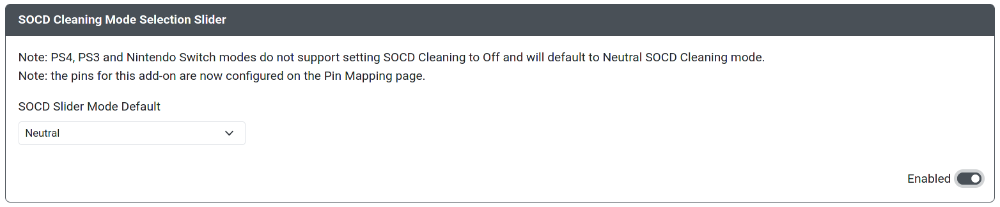

# SOCD Selection Slider

Purpose: This add-on is intended to allow users change the method of SOCD cleaning using a three position toggle switch or slide toggle.

## Web Configurator Options

- `SOCD Slider Mode Default` - The default SOCD mode to be used when the slider pin is not activated.
- `SOCD Slider Mode One` - The SOCD mode you would like to have enabled for the first slider position.
- `Pin One` - The GPIO pin used for first SOCD mode slider position.
- `SOCD Slider Mode Two` - The SOCD mode you would like to have enabled for the second slider position.
- `Pin Two` - The GPIO pin used for second SOCD mode slider position.

### SOCD Slider Mode Options

- [Up Priority](../hotkeys.mdx#socd-up-priority)
- [Neutral](../hotkeys.mdx#socd-neutral)
- [Last Win](../hotkeys.mdx#socd-last-win)
- [First Wins](../hotkeys.mdx#socd-first-wins)
- [SOCD Cleaning Off](../hotkeys.mdx#socd-cleaning-off)

## Hardware

### Requirements

The GPIO pins set in `SOCD Slider Mode One` and `SOCD Slider Mode Two` will each need to be brought and kept low to remain active to use that mode and when using the default mode, neither pin can be brought low. Therefore, a 3 position toggle switch or slide toggle is necessary for proper use of this add-on.

### Installation

Installation will depend on whether a toggle switch or slide toggle is used. In general, on one side of the switch, connect the pin to the GPIO pin set in `SOCD Slider Mode One`. On the other side of the switch, connect the pin to the GPIO pin set in `SOCD Slider Mode Two`. On the center pin, connect it to any GND pin.

## Miscellaneous Notes

Enabling this add-on will disable the use of the SOCD cleaning [Hotkey Shortcuts](../hotkeys.mdx), resulting in the toggle switch or slide toggle set up with this add-on being the only method to set the SOCD cleaning mode.
