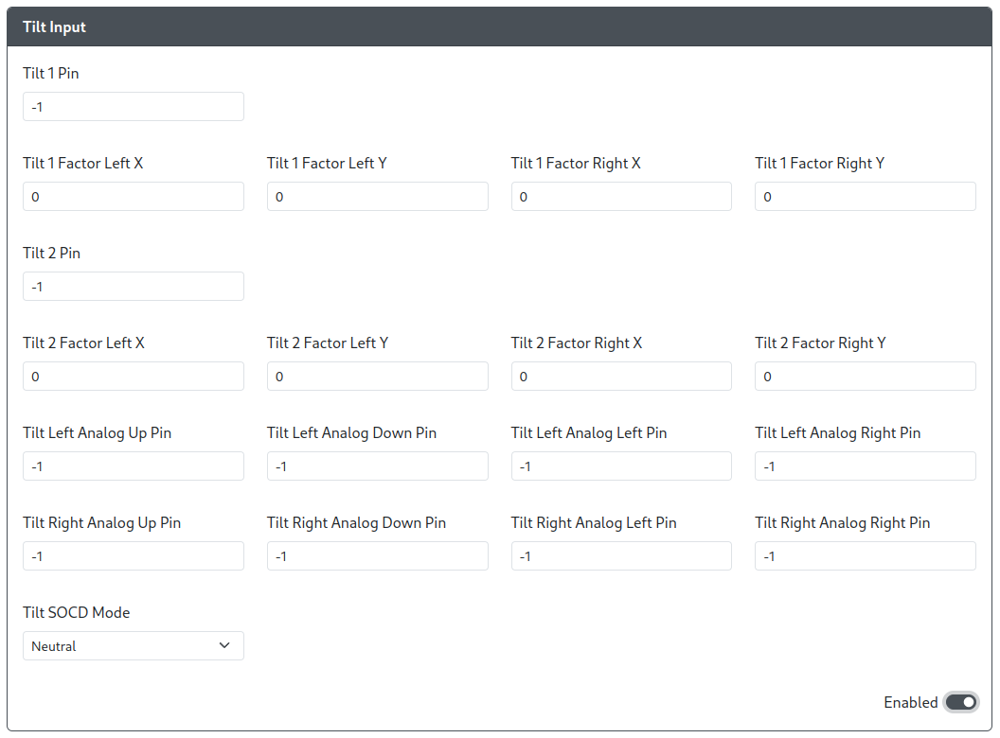

# Tilt Input

Purpose: The Tilt Input add-on allows users to send analog inputs from the Left and Right analog joysticks that are some percent of the maximum directional input (e.g. send 65% of a Down-Right input on the Right analog joystick).

## Web Configurator Options

- `Tilt 1 Pin` - The GPIO pin used for the Tilt 1 direction.
- `Tilt 1 Factor Left X` - The percentage of the X-axis input for the Left analog joystick sent when `Tilt 1 Pin` is activated. (Min. 0, Max 100)
- `Tilt 1 Factor Left Y` - The percentage of the Y-axis input for the Left analog joystick sent when `Tilt 1 Pin` is activated. (Min. 0, Max 100)
- `Tilt 1 Factor Left X` - The percentage of the X-axis input for the Right analog joystick sent when `Tilt 1 Pin` is activated. (Min. 0, Max 100)
- `Tilt 1 Factor Left Y` - The percentage of the Y-axis input for the Right analog joystick sent when `Tilt 1 Pin` is activated. (Min. 0, Max 100)
- `Tilt 2 Pin` - The GPIO pin used for the Tilt 2 direction.
- `Tilt 2 Factor Left X` - The percentage of the X-axis input for the Left analog joystick sent when `Tilt 2 Pin` is activated. (Min. 0, Max 100)
- `Tilt 2 Factor Left Y` - The percentage of the Y-axis input for the Left analog joystick sent when `Tilt 2 Pin` is activated. (Min. 0, Max 100)
- `Tilt 2 Factor Left X` - The percentage of the X-axis input for the Right analog joystick sent when `Tilt 2 Pin` is activated. (Min. 0, Max 100)
- `Tilt 2 Factor Left Y` - The percentage of the Y-axis input for the Right analog joystick sent when `Tilt 2 Pin` is activated. (Min. 0, Max 100)
- `Tilt Left Analog Up Pin` - The GPIO pin used for the Up direction on the Left analog joystick.
- `Tilt Left Analog Down Pin` - The GPIO pin used for the Down direction on the Left analog joystick.
- `Tilt Left Analog Left Pin` - The GPIO pin used for the Left direction on the Left analog joystick.
- `Tilt Left Analog Right Pin` - The GPIO pin used for the Right direction on the Left analog joystick.
- `Tilt Right Analog Up Pin` - The GPIO pin used for the Up direction on the Right analog joystick.
- `Tilt Right Analog Down Pin` - The GPIO pin used for the Down direction on the Right analog joystick.
- `Tilt Right Analog Left Pin` - The GPIO pin used for the Left direction on the Right analog joystick.
- `Tilt Right Analog Right Pin` - The GPIO pin used for the Right direction on the Right analog joystick.
- `Tilt SOCD Mode` - Choose the default SOCD Cleaning Mode (Neutral, Last Win, First Win).

## Hardware

### Requirements

This add-on requires additional buttons or switches as this add-on entirely prevents the primary DPad from being set as the Left analog or Right analog joystick.

### Installation

For each button, connect one side of the button to their respective GPIO pin as assigned in the Web Configurator. Connect the other side of the buttons to GND.

## Miscellaneous Notes

- Because this add-on disables the DPad from being set as Left analog and Right analog, using the hotkeys `DPad Left Analog` and `DPad Right Analog` deactivates the DPad and using the `DPad Digital` will reactivate the DPad once more.
- Not all Tilt analog pins are required to be set, but not setting the pins will prevent you from using that input without using the Web Configurator to remap the inputs.
- Additionally, pressing Tilt 1 and Tilt 2 simultaneously while inputting Right analog joystick directions allows the Right analog joystick to function as the D-Pad directions.
- Pressing Tilt 1 and Tilt 2 simultaneously while inputting Left analog joystick will prioritize Tilt 1 and ignore Tilt 2.
