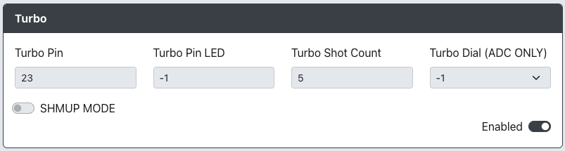
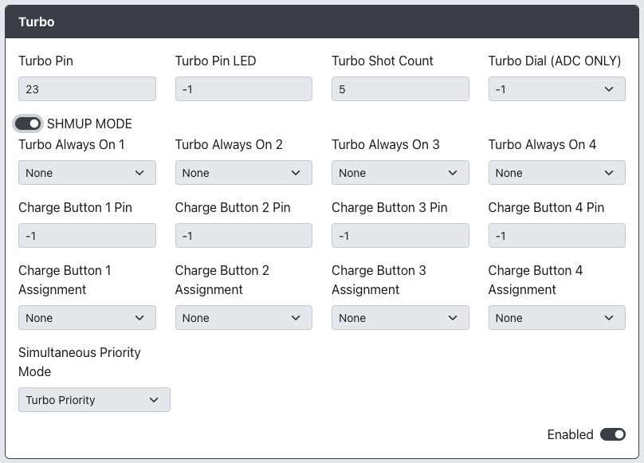

import InputTable from "../snippets/_input-table.mdx";

# Turbo

Purpose: This add-on is intended for you to change the behavior of controls so that holding a button triggers a fast series of separate button presses.

Turbo Mode is enabled/disabled on individual buttons by holding an input and then pressing the Turbo Button. This results in the input being repeatedly sent in rapid succession (according to the `Turbo Shot Count` set in the Web Configurator).

:::note

Turbo Mode is limited to non-directional inputs on the game pad.

:::

## Web Configurator Options

### General Options

- `Turbo Pin` - The GPIO pin used for the Turbo button, which toggles Turbo Mode on a button.
- `Turbo Pin LED` - The GPIO pin used for the Turbo LED.
- `Turbo Shot Count` - The number of of presses per second that the Turbo will activate at. (Range: 0-30)
- `Turbo Dial (ADC ONLY)` - The GPIO pin used for the Turbo dial.

:::caution

`Turbo Dial (ADC ONLY)` must be set as one of the ADC pins (GPIO 26-29) on the RP2040 board.

:::

### Turbo - SHMUP MODE

- `Turbo Always On 1-4` - These gamepad inputs will always send Turbo inputs (rapid, distinct button presses) even when Turbo mode is not enabled.
- `Charge Button 1-4 Pin` - These GPIO pins used for an additional button that can be held down and send one sustained input regardless of Turbo status.
- `Charge Button 1-4 Assignment` - These inputs that are associated with their respective`Charge Button 1-4` buttons.
- `Simultaneous Priority Mode` - Which of the two modes below should take priority.
  - `Turbo Priority` - When a Charge Button and a gamepad input with Turbo Mode are pressed simultaneously, apply Turbo Mode behavior.
  - `Charge Priority` - When a Charge Button and a gamepad input with Turbo Mode are pressed simultaneously, only send the input being held as a Charge Shot.

:::note

- In order for these options to work, the `Turbo Pin` must be set to some GPIO pin and not disabled (-1).
- `Charge Button 1-4 Pin` must be set to GPIO pins that are not currently assigned to any other inputs.

:::

Some of the options above uses the following GP2040 input labels for input mapping from controller to GP2040-CE.

<InputTable />

### Requirements

Additional buttons are required for the Turbo Button as well as each of the additional Charge Buttons desired for a minimum of one button and a maximum of 4 buttons.

If a Turbo LED is desired, an 3.3V non-addressable non-RGB LED is required. This type of LED should only have 2 conductors, power and ground. Because this is using power from

### Installation

For each button, connect one side of the button to their respective GPIO pin as assigned in the Web Configurator. Connect the other side of the buttons to GND.

For the Turbo LED, connect one side of the LED to the GPIO pin assigned in the Web Configurator. Connect the other side of the LED to GND.

## Miscellaneous Notes

None.
