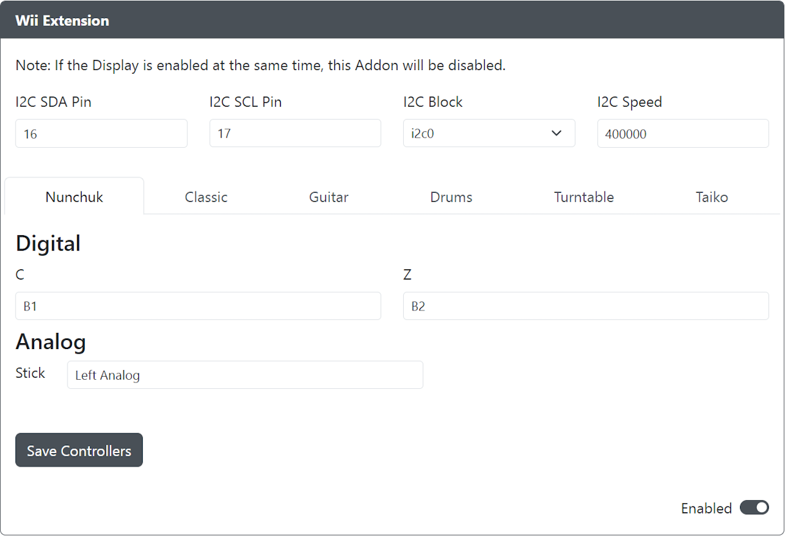
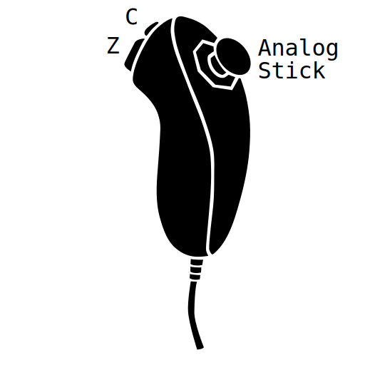
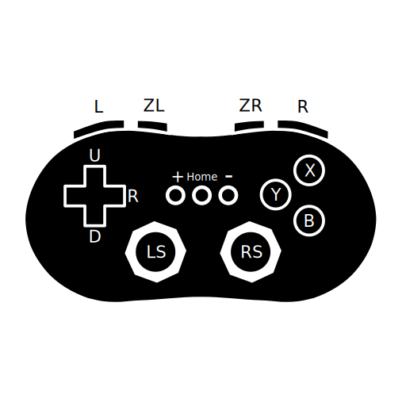
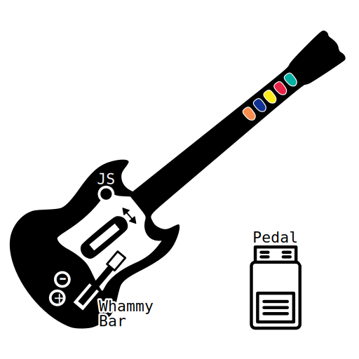
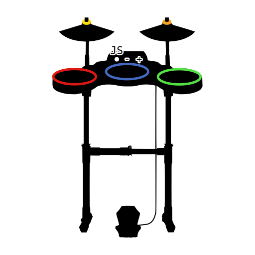
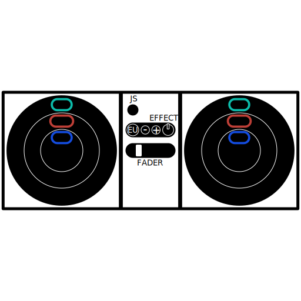
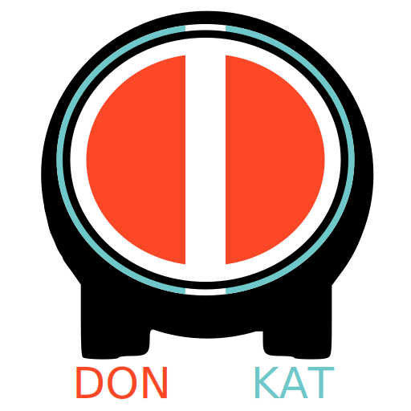

import Tabs from "@theme/Tabs";
import TabItem from "@theme/TabItem";
import InputTable from "../snippets/_input-table.mdx";

# Wii Extensions

Purpose: This add-on is intended to allow you to use various Wii controllers (e.g. Nunchuck, Classic Wii Controller, Guitar, Drums, Turntable, and Taiko) with GP2040-CE to be used with GP2040-CE supported systems.

:::note

The Wii Extensions add-on is not meant to work with Wii consoles.

:::

## Web Configurator Options

- `I2C SDA Pin` - The GPIO pin used for Wii Extension SDA.
- `I2C SCL Pin` - The GPIO pin used for Wii Extension SCL.
- `I2C Block` - The block of I2C to use (i2c0 or i2c1).
- `I2C Speed` - Sets the speed of I2C communication. Common values are `100000` for standard, or `400000` for fast.

### Controller Specific Options

<Tabs groupId="wii-extenstions" defaultValue="Nunchuck">
<TabItem value="Nunchuck" label="Nunchuck" default>

</TabItem>
<TabItem value="Classic" label="Classic" default>

:::note

- Classic Controller support includes Classic, Classic Pro, and NES/SNES Mini Controllers.
- Original Classic Controller L & R triggers are analog sensitive, where Pro triggers are not.

:::

</TabItem>
<TabItem value="Guitar" label="Guitar" default>

</TabItem>
<TabItem value="Drums" label="Drums" default>

:::note

Due to an accessory hardware issue, Drum & DJ turntable controllers may require hot-swapping from a Nunchuk or Classic controller before being usable.

:::

</TabItem>
<TabItem value="Turntable" label="Turntable" default>

</TabItem>
<TabItem value="Taiko" label="Taiko" default>

</TabItem>
</Tabs>

Each of the options above uses the following GP2040 input labels for input mapping from controller to GP2040-CE.

<InputTable />

### Requirements

This add-on requires some way to connect to the following pins as needed from the controller to the GP2040-CE device.

- `PWR` - 3.3V to power the device (May also be labeled `+` or `VIN`)
- `GND` - Ground (May also be labeled `-`)
- `SDA` - Serial Data Line (May also be labeled `C`)
- `SCL` - Serial Clock Line (May also be labeled `D`)

:::note

Breakout boards are commercially available and searching online for "Wiichuck Adapter" will produce a number of options.

Some boards will include a 3.3V output that is not necessary for this add-on to function.

:::

### Installation

Connect from Wii controller/adapter to the GP2040-CE board according to GPIO pins set in the Web Configurator.

- `PWR` - 3.3V to power the device (May also be labeled `+` or `VIN`)
- `GND` - Ground (May also be labeled `-`)
- `SDA` - Serial Data Line (May also be labeled `C`)
- `SCL` - Serial Clock Line (May also be labeled `D`)

## Miscellaneous Notes

None.
