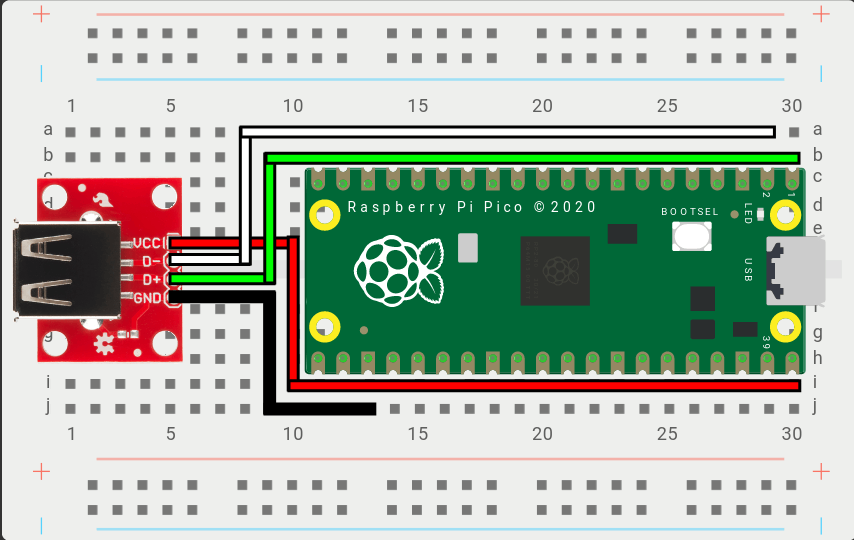

import Tabs from "@theme/Tabs";
import TabItem from "@theme/TabItem";
import PinOption from "./_pin-options-USB-Host.mdx";

<Tabs groupId="boards" defaultValue="Generic USB Host Port">
<TabItem value="Generic USB Host Port" label="Generic USB 2.0 Host Port" default>

### Example Wiring

- `VCC` - Connects to 5V power (Example: VBUS on the Raspberry Pi Pico)
- `D+` - Connects to the `D+` GPIO Pin above, set in the Web Configurator. (Example: GPIO0 on the Raspberry Pi Pico)
- `D-` - Connects to the `D-` GPIO Pin above, automatically set based on D+. (Example: GPIO1 on the Raspberry Pi Pico)
- `GND` - Connects to a ground pin, any `GND` pin will work. (Example: GND on the Raspberry Pi Pico)

:::note

For `D+` and `D-`, any set of GPIO pins can be used from the RP2040. However, there is a requirement that `D-` GPIO must immediately follow `D+`.

:::

</TabItem>
<TabItem value="USB Passthrough Board" label="USB Passthrough Board" default>

### Example Wiring

Step 1: Take the USB passthrough board and place it on a clean surface.

---

Step 2: Take one of the cables and place it on a clean surface.

:::note

The cables are JST 2.00mm 2pin same direction cables that are 10cm (100mm) in length. They can be made by hand or purchased directly from a variety of sellers on AliExpress. If you plan on installing the USB passthrough board somewhere else in your case you may want to get longer cables. For this install guide you will need three of the cables.

:::

---

Step 3: Connect one end of the first JST 2.00mm 2pin cable into the socket labeled 5V IN on the USB passthrough board.

:::note

The direction of the cable does not matter as they are all same direction cables.

:::

---

Step 4: Connect the other end of the first JST 2.00mm 2pin cable to the socket labeled 5v OUT on the RP2040 Advanced Breakout Board.

---

Step 5: Connect one end of the second JST 2.00mm 2pin cable into the socket labeled D+ OUT on the USB passthrough board.

---

Step 6: Connect the other end of the second JST 2.00mm 2pin cable to the socket labeled OPTION 5 on the RP2040 Advanced Breakout Board.

:::note

You can use other option sockets for this as well, but for the sake of this installation guide we will be using Option 5 and Option 6.

:::

---

Step 7: Connect one end of the third JST 2.00mm 2pin cable into the socket labeled D- OUT on the USB passthrough board.

---

Step 8: Connect the other end of the third JST 2.00mm 2pin cable to the socket labeled OPTION 6 on the RP2040 Advanced Breakout Board.

</TabItem>
</Tabs>
