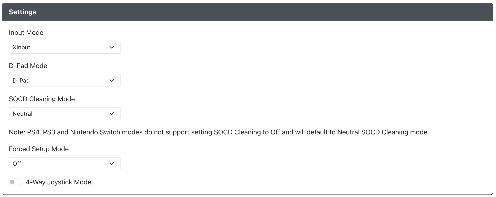
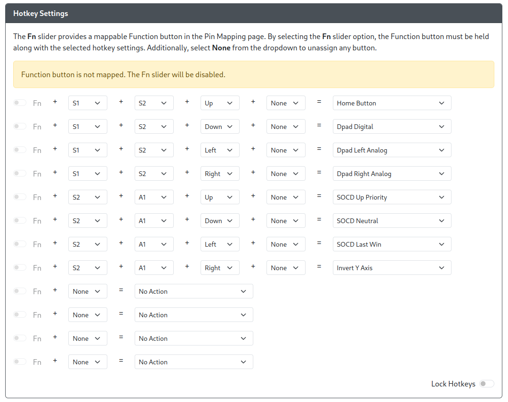

# Settings

Here you can select the basic settings which are normally available via hotkeys.

- `Input Mode` - Choose the main input mode (XINPUT, DINPUT, Switch, PS4, HID-Keyboard) this connected device will boot into when powered on. This selection will persist through unplug / replug.
- `D-Pad Mode` - Choose the default D-Pad mode (D-Pad, Left Stick or Right Stick).
- `SOCD Cleaning Mode` - Choose the default SOCD Cleaning Mode (Neutral, Last Win, First Win, OFF). Please note that PS4, PS3 and Nintendo Switch modes do not support setting SOCD to off and will default to Neutral SOCD.
- `Forced Setup Mode` - Allows you to lock out Input Mode, the ability to enter Web-Config or both. Enabling a web-config lockout will require you to nuke and reload the firmware if you wish to make further changes.
- `4-Way Joystick Mode` - Enables 4-Way Joystick mode which will prevent cardinal directions.

Please note that if you choose `PS4` mode you will have an additional option to set the device as a `Controller` or a `Fightstick`. If you choose `Fightstick` and want to use this device with compatible PS5 games you will need to enable the `PS Passthrough` add-on and have a way to connect the device you with to use for passthrough authentication to the RP2040-CE based device via a USB passthrough port.

## Hotkey Settings

An arbitrary number of buttons and directions, plus the optional Function (Fn) button, can be used to define
desired hotkey actions. Select Fn if desired, plus one or more buttons/directions, and associate them with a
hotkey action. The default hotkeys can be modified or removed, and new ones added, up to 12 in total.

The available hotkey actions will expand over time. We may also expand the number of hotkeys available to
configure in the future.
