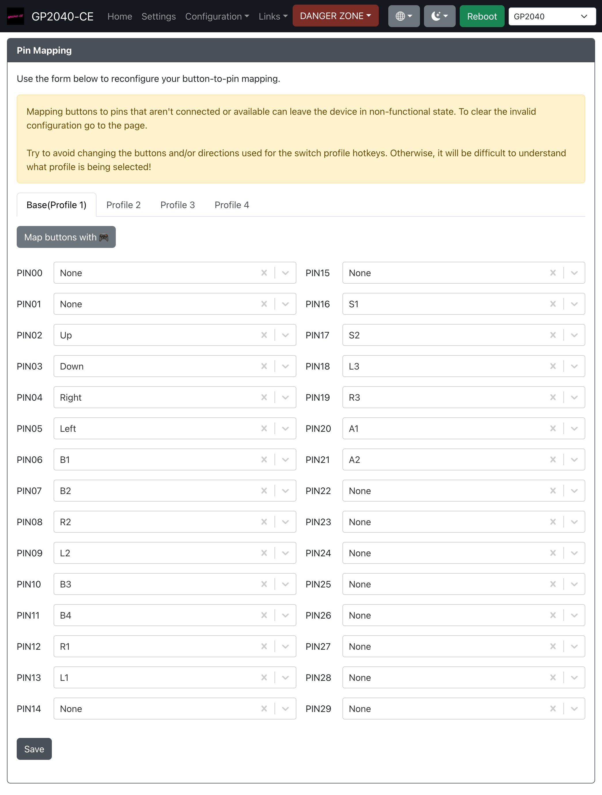

# Pin Mapping

Here you can remap the GP2040-CE buttons to different GPIO pins on the RP2040 chip. This can be used to simply remap buttons, or bypass a GPIO pin that may have issues on your device.
