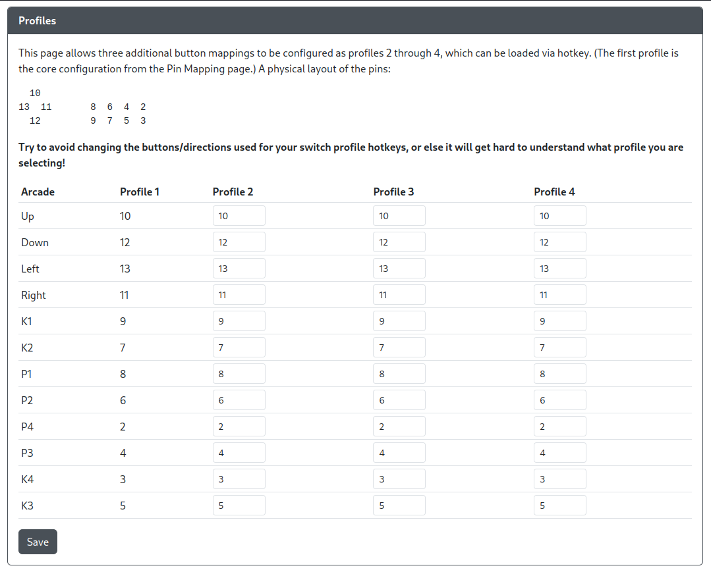

# Profile Settings

Here you can set profiles that will change the GPIO to GP2040-CE button mapping based on what profile you have set. You can change the profile number either using the Web Configurator or using a hotkey shortcut.
