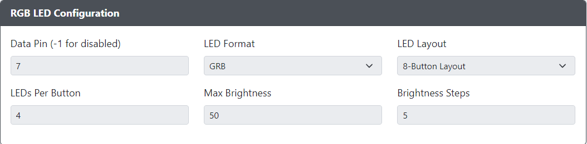
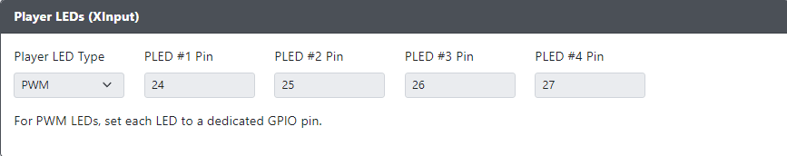
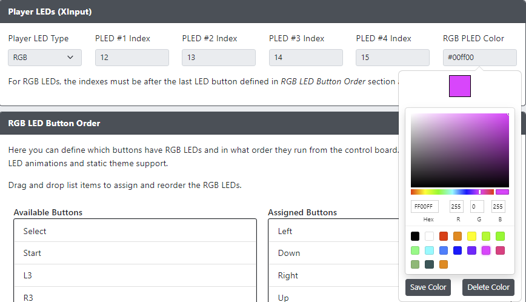
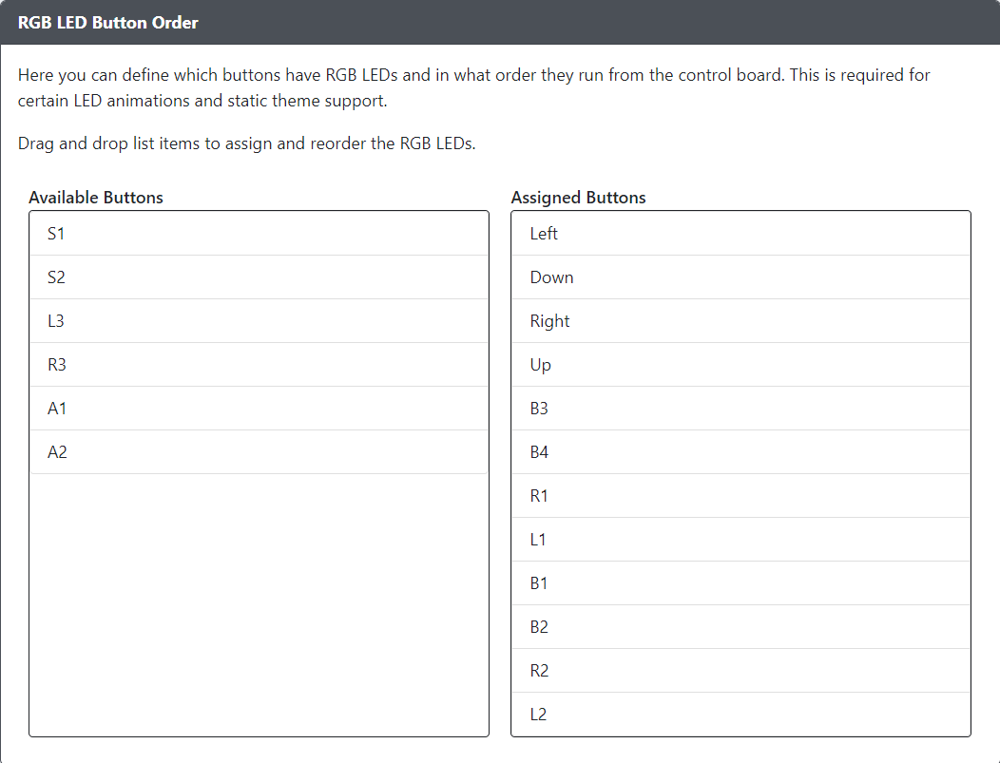

# LED Configuration

If you have a setup with per-button RGB LEDs, they can be configured here.

## RGB LED Configuration

- `Data Pin` - The GPIO pin that will drive the data line for your RGB LED chain. Set to `-1` to disable RGB LEDs.
- `LED Format` - The data format used to communicate with your RGB LEDs. If unsure the default `GRB` value is usually safe.
- `LED Layout` - Select the layout for your controls/buttons. This is used for static themes and some per-button animations.
- `LEDs Per Button` - Set the number of LEDs in each button on your chain.
- `Max Brightness` - Set the maximum brightness for the LEDs. Ranges from 0-255.
- `Brightness Steps` - The number of levels of brightness to cycle through when turning brightness up and down.

## Player LEDs (XInput)

Available selections for `Player LED Type` are `None`, `PWM` or `RGB`.

### PWM Player LEDs

- `PLED #[1-4] Pin` - The GPIO pin the standard LED is connected to.

### RGB Player LEDs

:::note

Please note that RGB Player LEDs must be located at an index after the RGB LED Buttons on the LED strip! The Web Config interface will suggest a starting index based on the number of LED buttons mapped in [RGB LED Button Order](#rgb-led-button-order) and the select `LEDs Per Button` value. We hope to remove this limitation in the future.

:::

- `PLED #[1-4] Index` - The index of the LED module on the RGB strip.
- `RGB PLED Color` - Click the box to reveal a color picker, or manually enter the color.

## RGB LED Button Order

:::note

Please note that RGB Button LEDs must be the first LEDs configured. They will start at index 0 on the RGB LED strip.

:::

- `LED Button Order` - Configure which buttons and what order they reside on the LED chain.
