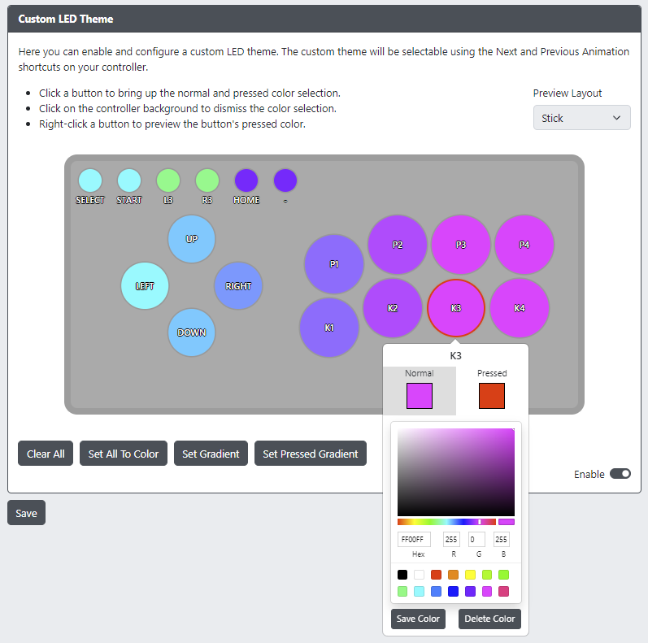

# Custom LED Theme

- `Enable` - Enables the use of Custom LED Theme.
- `Preview Layout` - Predefined layouts for previewing LED theme. **NOTE:** This is for preview only, does not affect controller operation.
- `Clear All` - Prompts for confirmation to reset the current theme to all buttons black (LEDs off). Make sure you have saved and have a backup if you don't want to lose your customizations.
- `Set All To Color` - Presents a color picker to set all buttons to the same normal or pressed color.
- `Set Gradient` - Sets a horizontal gradient across the action buttons according to the `Preview Layout` selection.
- `Set Pressed Gradient` - Same as `Set Gradient`, but for pressed button state.
- `Save Color` - Save a custom color to the color picker palette.
- `Delete Color` - Deletes a custom color from the color picker palette. Stock colors cannot be deleted.

:::note

All saved colors and gradient selections are saved to your browser's local storage.

:::

If enabled, the Custom LED Theme will be available as another animation mode and will cycle with the `Previous Animation` and `Next Animation` shortcuts on your controller. You can also use the [Data Backup and Restoration](#data-backup-and-restoration) feature to create and share themes!
