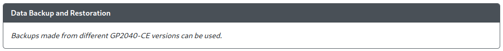
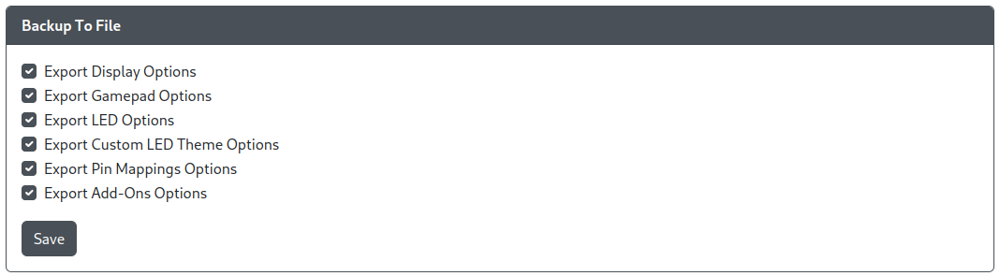
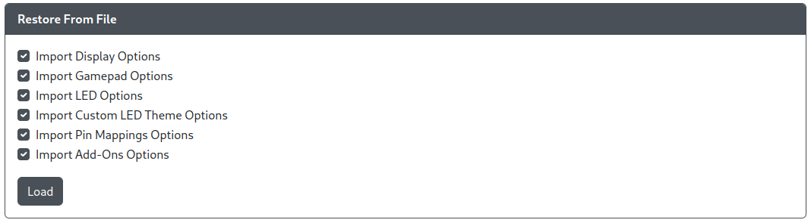

# Data Backup and Restoration

- `Backup To File` - Allows you to select what to backup to a file (default is all selected).
- `Restore From File` - Allows you to select what to restore from a file (default is all selected).
